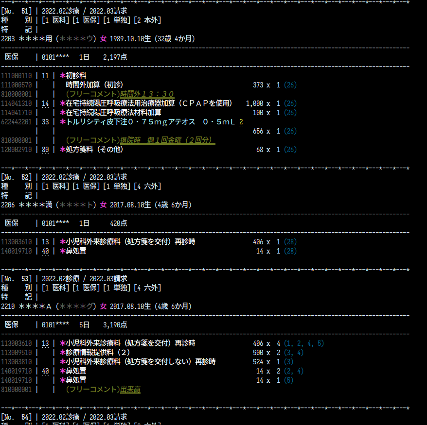
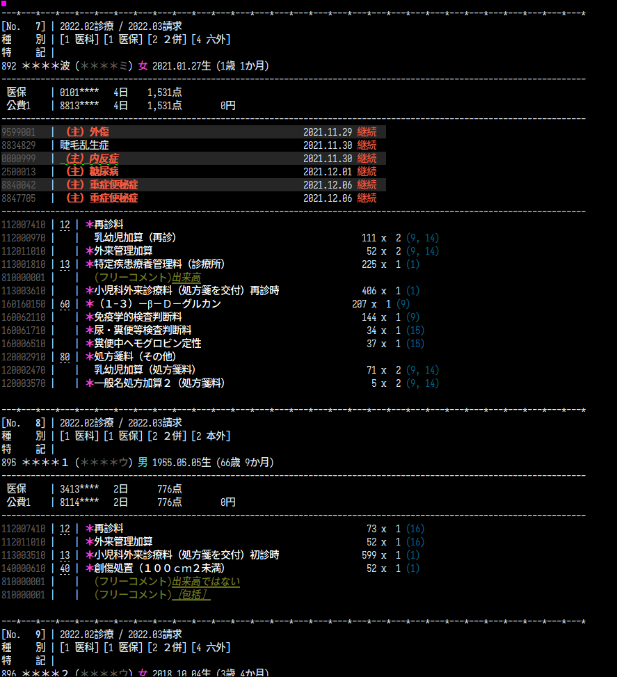
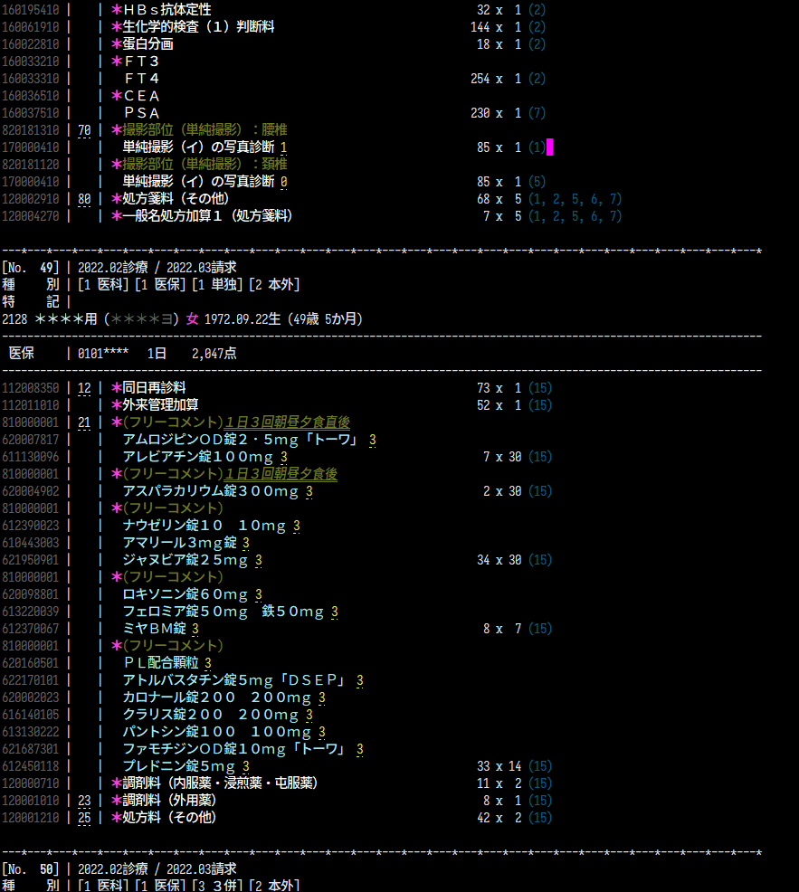
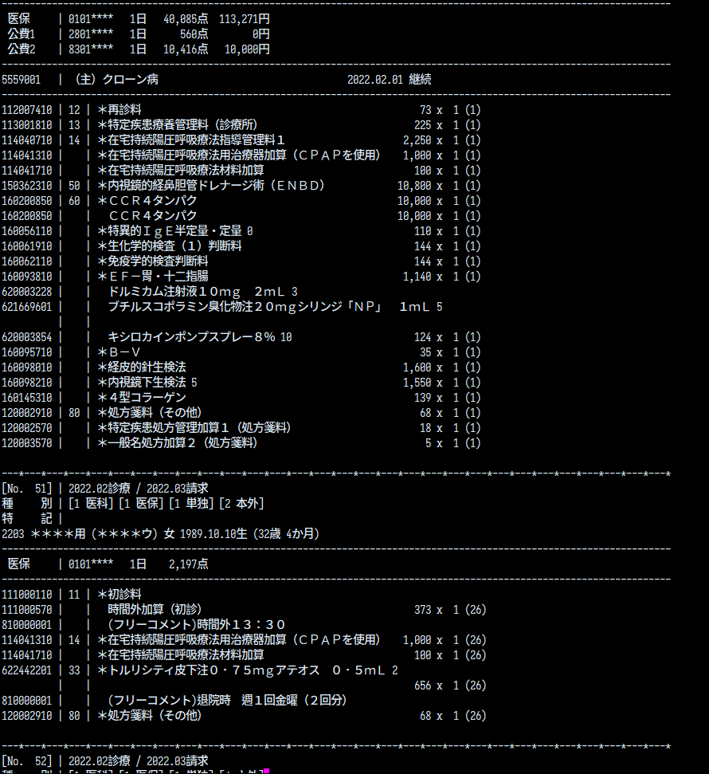

# Recediff

## Known bugs

- Can't parse `TO` records correctly.

## Installation

```bash
$ git clone git@github.com:yokenzan/recediff.git
$ bundle install
$ bundle exec bin/recediff --version
```

## Commands

### `--preview`

```bash
# UKE file as input, output whole receipts
$ bundle exec bin/recediff --preview path/to/RECEIPTC.UKE --all

# UKE file as input, output some receipts by passing receipt sequences
$ bundle exec bin/recediff --preview path/to/RECEIPTC.UKE --seqs=1,10-15,100

# UKE file as input, output some area by passing range of line number in UKE file
$ bundle exec bin/recediff --preview path/to/RECEIPTC.UKE --from=0 --to=100

# UKE file whose content is imcomplete as input
$ bundle exec bin/recediff --preview path/to/peace_of_RECEIPTC.UKE --all

# UKE content given via STDIN as input
$ cat path/to/RECIPTC.UKE | bundle exec bin/recediff --preview --all

# incomplete UKE content given via STDIN as input
$ cat calc_units.csv | bundle exec bin/recediff --preview --from=0 --to=100
```

other options:

| option            | description                                                | default |
|-------------------|------------------------------------------------------------|---------|
| `--[no-]color `   | print as colored text(expected to be output into terminal) | false   |
| `--[no-]header`   | whether show receipt summary information                   | true    |
| `--[no-]hoken`    | whether show insurance information                         | true    |
| `--[no-]disease`  | whether show disease information                           | true    |
| `--[no-]calcunit` | whether show content information                           | true    |
| `--[no-]mask`     | whether mask patient and insurance information             | false   |

### `--daily-cost-list`

### `--ef-like-csv`


## Configuration to use from Vim

### config to show previews in floating window

```vim
function! UkeGetPreviewedText(uke_text) abort
    return system('cd path/to/recediff/root/dir && bundle exec bin/recediff --preview', a:uke_text)
endfunction

function! UkePopupPreview(start, end) abort
    let l:uke_text = getline(a:start, a:end)

    if empty(l:uke_text)
        call echomsg('text is empty')
        return
    endif

    let l:previewed_text = UkeGetPreviewedText(l:uke_text)

    call popup_atcursor(split(l:previewed_text, "\n"), {})
endfunction

command! -range UkePreview call UkePopupPreview(<line1>, <line2>)
```

You will get a preview of recceipts nearby the cursor position by selecting area and call `:'<,'>UkePreiew`.

### config to show previews with quickrun

```vim
au BufNewFile,BufRead *.UKE setf uke

let g:quickrun_config.uke = {
            \       'command':                     'bin/recediff',
            \       'exec':                        'bundle exec %c %o %s',
            \       'cmdopt':                      '--preview --from=0',
            \       'outputter':                   'quickfix',
            \       'hook/cd/directory':           'path/to/recediff/root/dir',
            \       'hook/output_encode/encoding': 'cp932:cp932'
            \   }
```

## Screenshot


| screenshots                   |
|-------------------------------|
|  |
|  |
|  |
|  |
